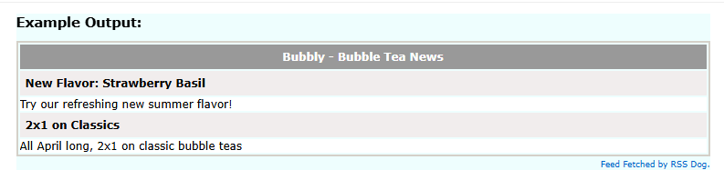

# Bubbly — Bubble Tea Shop

A responsive single-page application for a bubble tea shop, built with React and Vite. It includes a product catalog, an interactive map, a contact form and a review section powered by Firebase.

---

## Now Live Demo on Firebase Hosting!
You can view the live application here:
https://bubbly-369ad.web.app

---
## RSS Feed

Bubbly provides an RSS feed with the latest news and events:


---

## Authentication with Google

Bubbly uses **Firebase Authentication** to allow users to sign in with their Google accounts. This feature provides a secure login with Google Sign-In.

---

## Table of Contents

- [Description of the main page](#description-of-the-main-page)
- [Third-party components](#third-party-components)
- [Getting started](#getting-started)
- [Data Import and Export](#data-import-and-export)
- [Project structure](#project-structure)
- [Branches](#branches)
- [Images and assets](#images-and-assets)
- [License](#license)

---

## Description of the main page

The **home page** loads at the root URL (`/`) and at `/home`. It includes:

- A **hero section** with a short headline, description, and call-to-action buttons (View menu, Find us).
- A **featured products** section (“Nuestras estrellas”) that displays a grid of bubble tea items. Each item is rendered from a JSON array of products (name, price, image, description) via the `ProductCard` component, which receives product data as props. The layout is responsive using Flexbox and CSS Grid with media queries.
- A final **CTA block** inviting users to customise their drink and to get in touch.

The same **Header** (logo + navigation: Home, Menu, Contact) and **Footer** (legal text, social links, internal links) appear on all main pages.

---

## Third-party components

- **[React Router](https://reactrouter.com/)** — Client-side routing (e.g. `/`, `/home`, `/menu`, `/contact`, `/legal`).
- **[Leaflet](https://leafletjs.com/)** and **[React Leaflet](https://react-leaflet.js.org/)** — Interactive map on the Contact page to show the store location.

---

## Tutorials and references

- [Best README Template](https://github.com/othneildrew/Best-README-Template) — Structure and style of this README.
- [React Leaflet – Getting started](https://react-leaflet.js.org/docs/start-introduction/) — Map integration.
---

## Getting started

**Requirements:** Node.js (LTS) and npm.

1. Clone the repository (see [Branches](#branches) for `main` and `develop`).
2. Install dependencies and run the dev server:

```bash
npm install
npm run dev
```

3. Open [http://localhost:5173](http://localhost:5173) or [http://localhost:5173/home](http://localhost:5173/home).

**Build for production:**

```bash
npm run build
npm run preview
```

---

## Data Import and Export

Bubbly supports importing and exporting reviews in multiple formats. This feature is located in the **Data Management** page.

### Supported Formats:
- **JSON, CSV, TSV, XML, HTML, YAML, XLSX, XLS, and ODS**.

### Sample Import Files:
You can download these examples to test the import functionality:
- [datos.json](./public/datos.json)
- [datos.csv](./public/datos.csv)
- [datos.tsv](./public/datos.tsv)
- [datos.xml](./public/datos.xml)
- [datos.html](./public/datos.html)
- [datos.yaml](./public/datos.yaml)
- [datos.xlsx](./public/datos.xlsx)
- [datos.xls](./public/datos.xls)
- [datos.ods](./public/datos.ods)

The application allows you to preview and edit the data in a table before synchronizing it with **Firebase Firestore**. Access to Firebase is centralized in the `src/services/` directory.

---

## Project structure

- `src/`
  - `components/` — Reusable UI (e.g. `header`, `footer`, `product-card`).
  - `pages/` — Route-level views.
  - `services/` — Centralized access to Firebase (Firestore, Auth) and data processing utilities.
  - `data/` — Static data like `products-data.js`.
  - `App.jsx` — Router and routes.
  - `index.css` — Global design tokens (colours, typography, spacing).

Naming conventions: **kebab-case** for folders and routes; **PascalCase** for React components and their CSS files; **camelCase** for variables; **kebab-case** for `className` and `id`.

---

## Branches

- **`main`** — Stable, deployable code.
- **`develop`** — Integration branch for ongoing work.

To create and use `develop`:

```bash
git checkout -b develop
git push -u origin develop
```

---

## Figma inspiration

https://www.figma.com/community/file/1547444497246071269

---

## License

This project is for educational use only.
